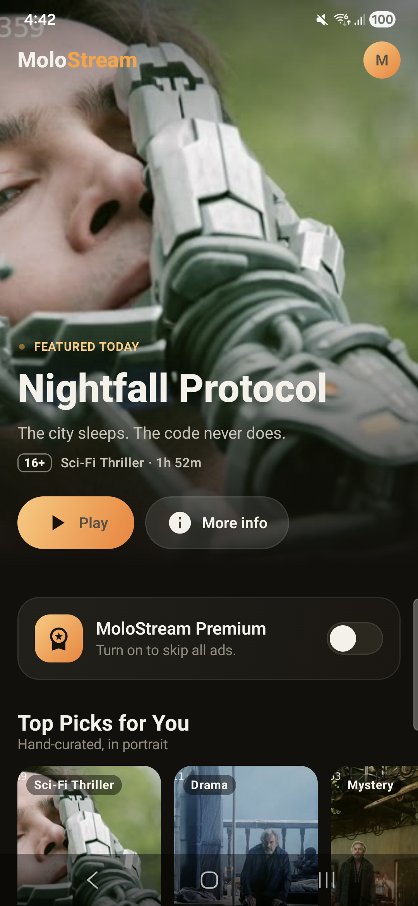
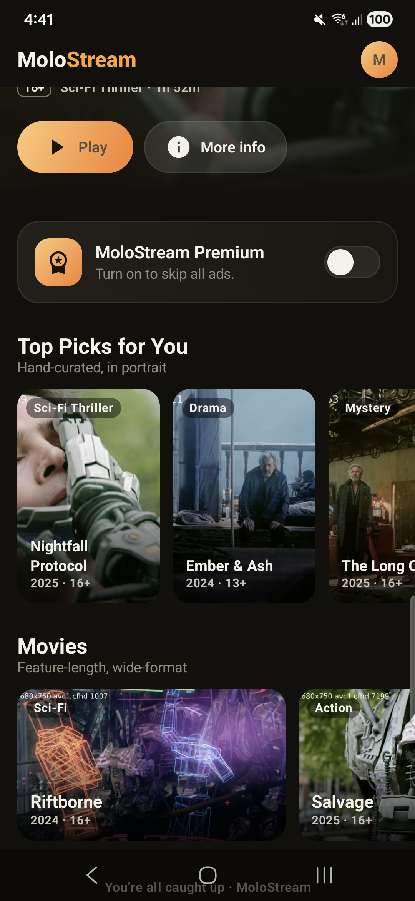
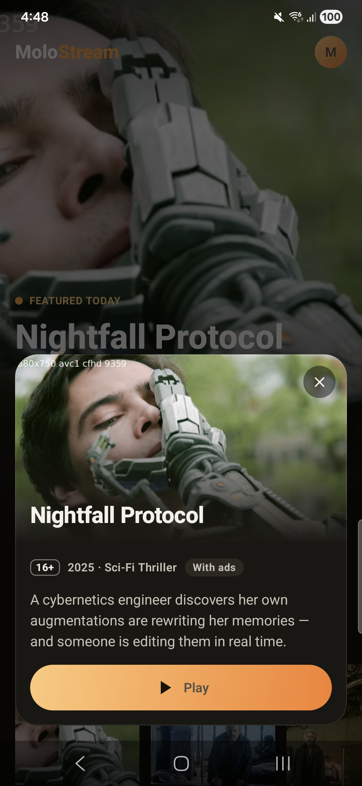
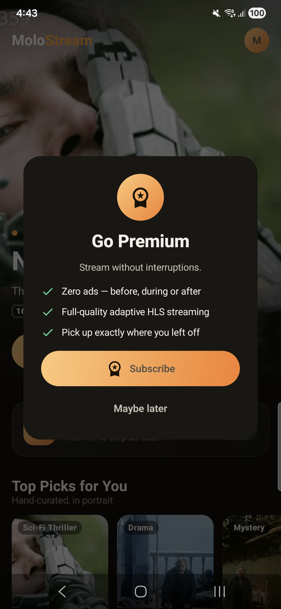
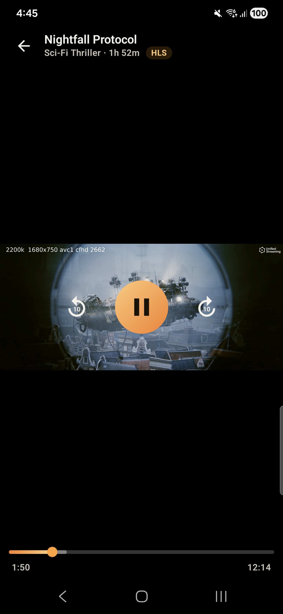
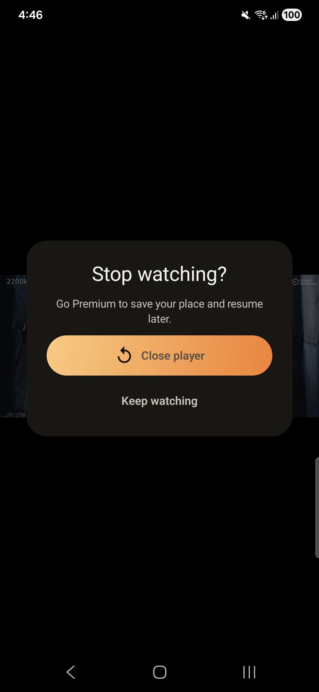

# MoloStream — Android

> A production-grade Android streaming app built with Jetpack Compose and ExoPlayer.


---

## Screenshots

<table>
  <tr>
    <td align="center"><br/><sub><b>Home</b></sub></td>
    <td align="center"><br/><sub><b>Carousels</b></sub></td>
    <td align="center"><br/><sub><b>Detail Sheet</b></sub></td>
  </tr>
  <tr>
    <td align="center"><br/><sub><b>Go Premium</b></sub></td>
    <td align="center"><br/><sub><b>Player</b></sub></td>
    <td align="center"><br/><sub><b>Exit Confirm</b></sub></td>
  </tr>
</table>

---

## Features

- **Curated home screen** — featured hero, vertical portrait carousel (*Top Picks*) and wide horizontal carousel (*Movies*), each with 10 titles sourced from real HLS stream frames
- **Adaptive HLS playback** — Media3 ExoPlayer streams the live HLS URL with automatic quality switching
- **Google IMA ads** — pre-roll, mid-roll, and post-roll VMAP ad breaks for free users; fully ad-free for subscribers
- **MoloStream Premium** — subscription toggle persisted with AES-256-GCM encrypted DataStore; survives process death and reinstalls
- **Continue Watching** — Room-backed watch-progress store surfaces a *Resume* prompt when reopening a title mid-way
- **Custom player controls** — fully Compose-drawn transport: play/pause, ±10 s skip, drag-to-scrub, auto-hide after 3 s, ad overlay with countdown
- **Title detail sheet** — rating, genre, synopsis, and a direct Play CTA without leaving the home screen
- **Single-Activity navigation** — Navigation 3 back-stack-as-state with type-safe keys; no fragments

---

## Tech Stack

| Layer | Technology |
|---|---|
| **UI** | Jetpack Compose · Material 3 · single Activity |
| **Navigation** | Navigation 3 (`androidx.navigation3`, back-stack-as-state) |
| **Player** | Media3 ExoPlayer · HLS · Google IMA SDK |
| **DI** | Koin (per-module declarations, composed in `:app`) |
| **Persistence** | Room (watch progress) · DataStore Preferences + AES-256-GCM keystore encryption (subscription) |
| **Image loading** | Coil 3 (asset-backed posters, no network required) |
| **Architecture** | Clean architecture · multi-module · version catalog · convention plugins |
| **Toolchain** | AGP 9.2.1 · Gradle 9.5.1 · Kotlin 2.3.21 · KSP 2.3.21 · compileSdk 36 · minSdk 24 · JDK 17 |

---

## Module Graph

```
:app                  Single Activity · Koin startup · Navigation 3 host
:feature:home         Home UI · hero · carousels · detail sheet · catalog datasource
:feature:player       ExoPlayer · IMA · custom Compose controls
:core:designsystem    Theme tokens (mango/dark) · shared components · strings
:core:model           Domain models — Movie, WatchProgress            [pure JVM]
:core:domain          Repository interfaces · use cases               [pure JVM]
:core:data            Repository impls · DI bindings
:core:database        Room — WatchProgress entity / DAO / DB
:core:datastore       Encrypted DataStore · KeystoreCrypto (AES-256-GCM)
:core:common          Dispatcher providers
:build-logic          Convention plugins (android-app / android-library / compose / room / jvm-library)
```

**Dependency rule:** features never depend on each other. `:feature:home` owns the catalog data source; `:feature:player` receives everything it needs (id, title, HLS URL, ad tag) through a type-safe `PlayerKey` and reads/writes progress via `:core:database`.

---

## Getting Started

### Prerequisites

- Android SDK — platform 36, build-tools 36
- JDK 17+
- A connected device or emulator (API 24+)

### Build & Run

```bash
# Clone and enter the mobile workspace
cd mobile/

# Debug build + install
./gradlew :app:installDebug

# Release APK (requires keystore — see CI section below)
./gradlew :app:assembleRelease
```

The first build downloads the Gradle 9.5.1 distribution and AGP automatically.

### Local Signing (optional)

Create `app/keystore.properties` (git-ignored):

```properties
storeFile=keystore.jks
storePassword=<your-password>
keyAlias=<your-alias>
keyPassword=<your-password>
```

Then place your `.jks` file in `app/`. The build falls back to debug signing when this file is absent.

---

## CI / GitHub Actions

Every push to `main` and every PR runs:

| Step | What it does |
|---|---|
| **Validate wrapper** | Checksum guard against a tampered `gradle-wrapper.jar` |
| **Android Lint** | Lint report uploaded as a workflow artifact |
| **Signed release APK** | `assembleRelease` signed from secrets; APK uploaded as `app-release-apk-<version>` |

`versionCode` and `versionName` auto-bump from the CI run number (`versionCode = run number`, `versionName = 1.0.<run number>`). Local builds fall back to `1` / `1.0`. Download release APKs from the **Actions → Artifacts** tab — they are git-ignored and never committed.

### Required Secrets

Configure under **Settings → Secrets and variables → Actions**:

| Secret | Description |
|---|---|
| `KEYSTORE_BASE64` | Release keystore, base64-encoded (`base64 -i release.keystore \| pbcopy`) |
| `KEYSTORE_PASSWORD` | Keystore store password |
| `KEY_ALIAS` | Key alias inside the keystore |
| `KEY_PASSWORD` | Key alias password |


### Git Hooks

Hooks live in `.githooks/` and are activated automatically on the next Gradle sync via an `:installGitHooks` task.

| Hook | Guards |
|---|---|
| `pre-commit` | **1. Secret scan** — regex sweep over the staged diff for API keys, tokens, private keys, and passwords |
| | **2. Large-file / binary guard** — blocks `.apk`, `.jks`, `.zip`, and other binaries; rejects any file over 1 MB |
| | **3. Kotlin** — `ktlintCheck` + `detekt` + `compileReleaseKotlin` (only when `.kt`/`.kts` files are staged) |
| | **4. Resource lint** — `:app:lintDebug` (only when `res/` XML or image files are staged) |
| `commit-msg` | Enforces [Conventional Commits](https://www.conventionalcommits.org) — `feat`, `fix`, `refactor`, `docs`, `test`, `chore`, `perf`, `ci`, `build`, `style`, `revert` with optional scope and breaking-change marker |
| `pre-push` | `compileReleaseKotlin` — final compile check before code leaves your machine |

Auto-fix formatting: `./gradlew ktlintFormat`  
Bypass a hook once: `git commit --no-verify` / `git push --no-verify`

---

## Architecture

```
┌──────────────────────────────────────────────────────────┐
│                      :app (host)                         │
│  MainActivity · MoloApplication · MoloNavHost            │
│  Koin: dataStoreModule + databaseModule + dataModule     │
│         + homeModule + playerModule                      │
└───────┬──────────────────┬──────────────────┬────────────┘
        │                  │                  │
 ┌──────┴──────┐   ┌───────┴──────┐   ┌──────┴──────┐
 │ :feature:   │   │  :feature:   │   │  :feature:  │
 │   splash    │   │    home      │   │   player    │
 └──────┬──────┘   └───────┬──────┘   └──────┬──────┘
        │                  │                  │
 ┌──────┴──────────────────┴──────────────────┴───────────┐
 │                        :core:*                         │
 │   model · domain · data · database · datastore         │
 │   designsystem · common                                │
 └────────────────────────────────────────────────────────┘
```

**Navigation flow** (Navigation 3, back-stack-as-state):

```
SplashKey --onFinished--> HomeKey --onOpenMovie(PlayerKey)--> PlayerKey
                             ^                                     |
                             +-------------- onBack ---------------+
```

Splash swaps itself out of the back stack on completion so Home becomes the true root; pressing back from Home shows an exit-app confirmation dialog rather than returning to the splash.

The `PlayerKey` carries everything the player needs — `movieId`, `title`, `hlsUrl`, `adTagUrl`, `isLive` — so `:feature:player` has zero dependency on `:feature:home`.

**Data flow:** UI observes `StateFlow` from ViewModels → ViewModels invoke use cases → use cases call repository interfaces → repository implementations coordinate Room, DataStore, and in-memory catalog sources.


---

## Project Structure

```
mobile/
├── app/                    Application module (MainActivity, Koin init, NavHost)
├── feature/
│   ├── splash/             Splash / launch screen
│   ├── home/               Home screen (hero, carousels, detail sheet)
│   └── player/             ExoPlayer + IMA + custom Compose controls
├── core/
│   ├── common/             Shared dispatcher providers
│   ├── data/               Repository implementations + DI bindings
│   ├── database/           Room — WatchProgress entity / DAO / DB
│   ├── datastore/          Encrypted DataStore + KeystoreCrypto (AES-256-GCM)
│   ├── designsystem/       Theme tokens, shared components, strings
│   ├── domain/             Repository interfaces + use cases (pure JVM)
│   └── model/              Domain models — Movie, WatchProgress (pure JVM)
├── build-logic/            Convention plugins (app / library / compose / room / jvm)
├── config/
│   └── detekt/             Detekt static-analysis ruleset
├── .githooks/              pre-commit · commit-msg · pre-push
├── .github/
│   ├── actions/setup-android/  Reusable composite action (JDK + SDK + Gradle cache)
│   └── workflows/ci.yml    CI pipeline (lint → signed release APK)
└── previews/               Device screenshots
```

